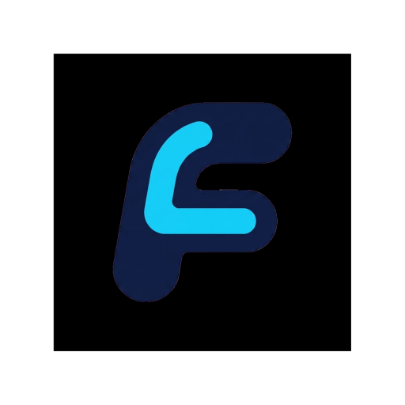

<p align="center">
  
</p>

<p align="center">
  <strong>An agent-native workbench for structured game development.</strong>
</p>

<p align="center">
  <strong>English</strong> ·
  <a href="README.zh.md">简体中文</a>
</p>

<p align="center">
  <a href="https://github.com/franknobox/Ludens-Flow">GitHub</a> ·
  <a href="agent_workbench/README.md">Workbench Docs</a> ·
  <a href="LICENSE">MIT License</a>
</p>

---

## What Is Ludens-Flow?

Ludens-Flow is a multi-agent game development workbench built around explicit artifacts, controlled tools, and project-level state.

It is designed to help teams and solo developers structure game development work, not just chat with a model.

Instead of treating the agent as a free-form assistant, Ludens-Flow puts it back inside an engineering system:

- services have boundaries
- outputs have schemas
- tools have permissions
- tasks have state
- projects have workspaces
- the UI makes the workflow visible

## What It Does

- Coordinates multiple specialized agents for design, planning, engineering, review, and coaching.
- Organizes work around explicit artifacts such as `GDD`, `PROJECT_PLAN`, `IMPLEMENTATION_PLAN`, and `REVIEW_REPORT`.
- Provides a web workbench with project switching, settings, file views, chat, streaming feedback, and tool progress.
- Supports project-scoped workspaces, structured tool execution, and controlled file operations.
- Integrates multimodal input such as images, text files, code files, and PDFs.
- Supports project profiles and externally imported Skills that can be enabled per project.
- Connects external game engines via MCP for live scene operations and asset manipulation (Blender verified; Unity/Godot/Unreal sandboxed).
- Provides a copywriting workspace with external references, live generation status, and Markdown/CSV export.
- Supports capability-aware model routing with per-project configuration.
- Offers a resilient web workbench with real-time streaming, tool progress tracking, and multi-theme support.

## What It Is Not

Ludens-Flow is **not** trying to fully auto-generate a complete game from one prompt.

It is a workflow system for:

- clarifying requirements
- structuring plans
- guiding implementation
- reviewing outputs
- making development steps traceable and reproducible

## Current Focus

Ludens-Flow is currently focused on:

- stabilizing the multi-agent workflow core and graph execution
- connecting real game engines via MCP for live asset and scene operations
- hardening project-level state persistence, metadata safety, and workspace isolation
- enriching the web workbench with tool observability, settings management, and responsive UX
- deepening the integration of Skills and user profiles into agent runtime behavior

See [ROADMAP.md](11_docs/ROADMAP.md) for the longer-term direction.

## Quick Start

#### 1. Install

```bash
pip install -e ./agent_workbench
```

#### 2. Web Workbench

Product mode:

```powershell
.\agent_workbench\scripts\start_web.ps1
```

Development mode:

```powershell
.\agent_workbench\scripts\start_web.ps1 -Mode dev
```

Default URLs:

- Product mode: `http://127.0.0.1:8011/`
- Dev frontend: `http://127.0.0.1:4173/`
- Dev API: `http://127.0.0.1:8011/`

CLI note: the `ludensflow` command is a legacy/debug entry for now and is not the recommended way to run the project.

## Project Structure

```text
Ludens-Flow/
├─ agent_workbench/   # core workflow engine, API, frontend, tests
├─ 11_docs/           # roadmap, design docs, long-form documentation
├─ 00_meta/           # schemas, repo rules, metadata
├─ workspace/         # runtime workspace and project data
├─ STATUS.md          # current project status snapshot
└─ README.md
```

## Screenshots

Screenshot placeholders can be added here later:

- Workbench overview
- Settings page
- Tool execution flow
- Workspace / file operation view

## Future Direction

Ludens-Flow is evolving toward a broader game-development AI workbench, including:

- deeper engine integration (viewport snapshots, material editing, Unity editor workflows)
- richer file and tool execution flows with batch operations and editor-side visualization
- broader engine compatibility such as Godot and UE
- stronger structured agent collaboration with role-based communication protocols
- in-game LLM integration
- collaboration platform visualization
- external AIGC ecosystem access
- release acceptance baselines and automated smoke tests

## Open Source

- Repository: <https://github.com/franknobox/Ludens-Flow>
- License: [MIT](LICENSE)

If you want to explore implementation details first, start with:

- [agent_workbench/README.md](agent_workbench/README.md)
- [STATUS.md](STATUS.md)
- [11_docs/ROADMAP.md](11_docs/ROADMAP.md)

> Originally initiated in the context of the 2026 SUAT AI Agent Innovation Competition, and now being shaped into a longer-lived open project.
